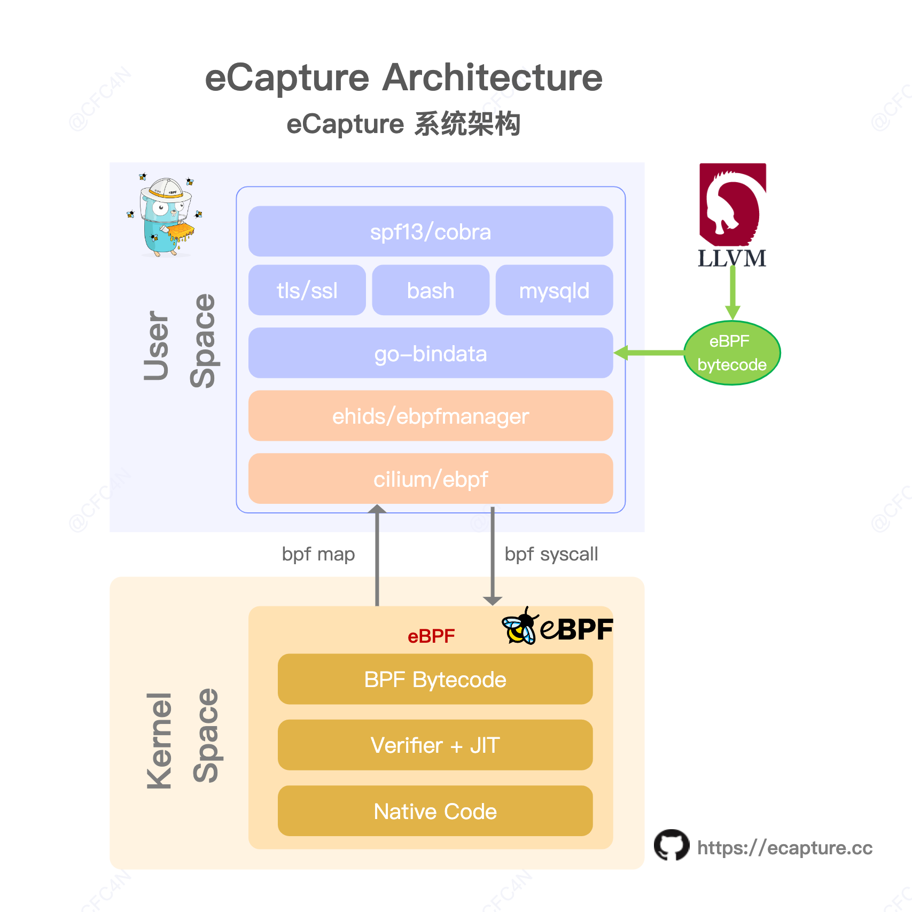

[English](./README.md) | 中文介绍

[](https://github.com/ehids/ecapture)
[](https://github.com/ehids/ecapture)
[](https://github.com/ehids/ecapture/actions/workflows/code-analysis.yml)
[](https://github.com/ehids/ecapture/releases)

### eCapture(旁观者): 基于eBPF技术实现TLS加密的明文捕获，无需CA证书。

> **Note**
>
> 支持 Linux系统内核4.15以上版本，支持Android系统内核5.4以上版本。
>
> 不支持Windows、macOS系统。

官方网站： [https://ecapture.cc](https://ecapture.cc)

----

# eCapture旁观者

eCapture的中文名字为**旁观者**，即「**当局者迷，旁观者清**」，与其本身功能**旁路、观察**契合，且发音与英文有相似之处。

# eCapture 工作原理


eBPF `Uprobe`/`Traffic Control`实现的各种用户空间/内核空间的数据捕获，无需改动原程序。

* SSL/HTTPS数据导出功能，针对HTTPS的数据包抓取，不需要导入CA证书。
* bash的命令捕获，HIDS的bash命令监控解决方案。
* mysql query等数据库的数据库审计解决方案。

# eCapture 系统架构


# 演示

## eCapture 使用方法
### 介绍文章
[eCapture：无需CA证书抓https明文通讯](https://mp.weixin.qq.com/s/DvTClH3JmncpkaEfnTQsRg)

### 演示视频
#### Linux上使用eCapture
[](https://www.bilibili.com/video/BV1si4y1Q74a "eCapture User Manual")

#### Android上使用eCapture
[](https://www.bilibili.com/video/BV1xP4y1Z7HB "eCapture for Android")
# 使用

## 直接运行

下载 [release](https://github.com/ehids/ecapture/releases) 的二进制包，可直接使用。

系统配置要求

* 系统linux kernel版本必须高于4.15。
* 开启BTF [BPF Type Format (BTF)](https://www.kernel.org/doc/html/latest/bpf/btf.html) 支持。 (可选, 2022-04-17)

## 命令参数

> **Note**
>
> 需要ROOT权限执行。

eCapture默认查找`/etc/ld.so.conf`文件，查找SO文件的加载目录，并查找`openssl`等动态链接路位置。你也可以通过`--libssl`
参数指定动态链接库路径。

如果目标程序使用静态编译方式，则可以直接将`--libssl`参数设定为该程序的路径。

### Pcapng输出格式

`./ecapture tls -i eth0 -w pcapng -p 443` 直接讲捕获的明文数据包保存为pcapng格式，直接使用`Wireshark`打开查看。

### 文本输出格式

`./ecapture tls` 将会输出所有的明文数据包，并捕获openssl TLS的密钥`Master Secret`
文件到当前目录的ecapture_master.log中。你也可以同时开启`tcpdump`抓包，再使用`Wireshark`打开，设置`Master Secret`路径，查看明文数据包。

### 验证方法：

```shell
cfc4n@vm-server:~$# uname -r
4.18.0-305.3.1.el8.x86_64
cfc4n@vm-server:~$# cat /boot/config-`uname -r` | grep CONFIG_DEBUG_INFO_BTF
CONFIG_DEBUG_INFO_BTF=y
```

### openssl的无证书抓包 openssl
执行任意https网络请求即可使用。
```shell
curl https://www.qq.com
```

### libressl&boringssl的测试验证
```shell
# 由于curl等工具依赖于原生openssl的安装，用以下方式测试，也可以重新编译安装相关的工具来测试
vm@vm-server:~$ ldd /usr/local/bin/openssl
	linux-vdso.so.1 (0x00007ffc82985000)
	libssl.so.52 => /usr/local/lib/libssl.so.52 (0x00007f1730f9f000)
	libcrypto.so.49 => /usr/local/lib/libcrypto.so.49 (0x00007f1730d8a000)
	libc.so.6 => /lib/x86_64-linux-gnu/libc.so.6 (0x00007f1730b62000)
	/lib64/ld-linux-x86-64.so.2 (0x00007f17310b2000)

# 使用libssl配置libssl.so的路径
vm@vm-server:~$ sudo ./ecapture tls --libssl="/usr/local/lib/libssl.so.52" --hex

# 另一个终端使用如下命令开启测试，可输入一些字符串，然后回车，观察ecapture的抓包输出
vm@vm-server:~$ /usr/local/bin/openssl s_client -connect www.qq.com:443

# boringssl的测试，同理
/path/to/bin/bssl s_client -connect www.qq.com:443
```

### bash的shell捕获
```shell
ps -ef | grep foo
```

# 微信公众号


## 自行编译
自行编译对编译环境有要求，参考**原理**章节的介绍。

# 原理
## eBPF技术
参考[ebpf](https://ebpf.io)官网的介绍

## uprobe HOOK

### openssl hook
本项目hook了`/lib/x86_64-linux-gnu/libssl.so.1.1`的`SSL_write`、`SSL_read`函数的返回值，拿到明文信息，通过ebpf map传递给用户进程。
```go
Probes: []*manager.Probe{
    {
        Section:          "uprobe/SSL_write",
        EbpfFuncName:     "probe_entry_SSL_write",
        AttachToFuncName: "SSL_write",
        //UprobeOffset:     0x386B0,
        BinaryPath: "/lib/x86_64-linux-gnu/libssl.so.1.1",
    },
    {
        Section:          "uretprobe/SSL_write",
        EbpfFuncName:     "probe_ret_SSL_write",
        AttachToFuncName: "SSL_write",
        //UprobeOffset:     0x386B0,
        BinaryPath: "/lib/x86_64-linux-gnu/libssl.so.1.1",
    },
    {
        Section:          "uprobe/SSL_read",
        EbpfFuncName:     "probe_entry_SSL_read",
        AttachToFuncName: "SSL_read",
        //UprobeOffset:     0x38380,
        BinaryPath: "/lib/x86_64-linux-gnu/libssl.so.1.1",
    },
    {
        Section:          "uretprobe/SSL_read",
        EbpfFuncName:     "probe_ret_SSL_read",
        AttachToFuncName: "SSL_read",
        //UprobeOffset:     0x38380,
        BinaryPath: "/lib/x86_64-linux-gnu/libssl.so.1.1",
    },
    /**/
},
```
### bash的readline hook
hook了`/bin/bash`的`readline`函数。

# 编译方法

针对个别程序使用的openssl类库是静态编译，也可以自行修改源码实现。若函数名不在符号表里，也可以自行反编译找到函数的offset偏移地址，填写到`UprobeOffset`属性上，进行编译。
笔者环境`ubuntu 21.04`， Linux Kernel 4.15以上通用。
**推荐使用`UBUNTU 21.04`版本的Linux测试。**

> **Note**
> 
> Android版本编译方法见 [eCapture旁观者：Android HTTPS明文抓包](https://mp.weixin.qq.com/s/KWm5d0uuzOzReRtr9PmuWQ)

## 工具链版本
* golang 1.17
* clang 12.0.0
* cmake 3.18.4
* clang backend: llvm 12.0.0
* kernel config:CONFIG_DEBUG_INFO_BTF=y (可选，2022-04-17增加)


## 编译

```shell
sudo apt-get update
sudo apt-get install --yes build-essential pkgconf libelf-dev llvm-12 clang-12 linux-tools-common linux-tools-generic
for tool in "clang" "llc" "llvm-strip"
do
  sudo rm -f /usr/bin/$tool
  sudo ln -s /usr/bin/$tool-12 /usr/bin/$tool
done
git clone git@github.com:ehids/ecapture.git
cd ecapture
make
bin/ecapture
```

## 未开启BTF的编译
2022/04/17起，eCapture支持了未开启BTF的系统编译，编译指令为：`make nocore`。

```shell
git clone git@github.com:ehids/ecapture.git
cd ecapture
make nocore
bin/ecapture
```


# 参考资料
[BPF Portability and CO-RE](https://facebookmicrosites.github.io/bpf/blog/2020/02/19/bpf-portability-and-co-re.html)
[ebpfmanager v0.2.2](https://github.com/ehids/ebpfmanager)